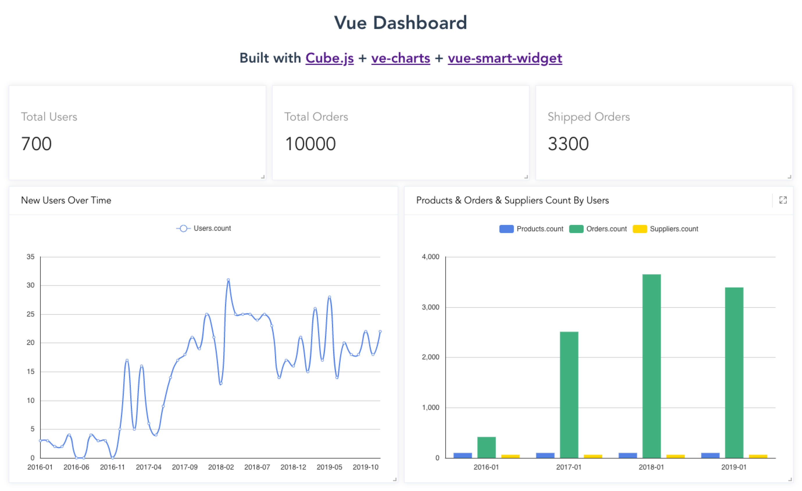

# Vue Dashboard

> Built with Cube.js + ve-charts + vue-smart-widget, It's Just a Demo.

## Preview



## Tech Stack

* Cube.js - 📊 Cube.js — Open-Source Analytical API Platform
* ve-charts - 📈 ECharts 4.x for Vue.js 2.x.
* vue-smart-widget - 🗃️ Smart widget is a flexible and extensible content container component for Vue2.x.

## Article

[Build A Vue Dashboard Using Cube.js](https://xlbd.me/posts/build-vue-dashboard-using-cubejs)

## Project setup
```
yarn install
```

### Compiles and hot-reloads for development
```
yarn serve
```

### Compiles and minifies for production
```
yarn build
```

### Lints and fixes files
```
yarn lint
```

### Customize configuration
See [Configuration Reference](https://cli.vuejs.org/config/).

## License

MIT [@xiaoluoboding]()
